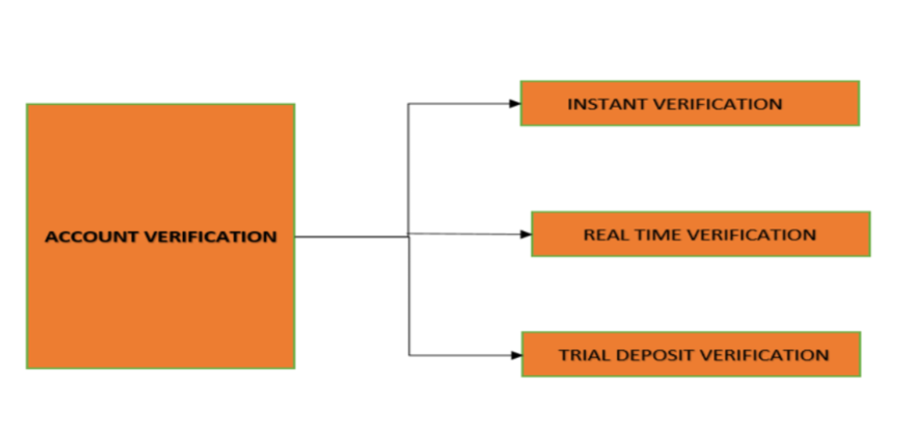

## Account Verification Methods

The Account Ownership verification service verifies account ownership by checking whether an account provided by a user exists, whether the user owns the account, and whether the account is active and in good standing. 

Account ownership verification is performed using the below three verification methods.

&nbsp;

<!-- theme: info -->
 
>**Note**  The client has the flexibility to specify at the home level and at the user level which account verification methods should be enabled. The specific verification method to be used for a user is passed by the client system in the verification request.

<!-- theme: info -->

>**Note**  A validation check is performed on the client request to confirm that it specifies the verification method to be used.

## See Also

[Quick Summary On Account Verification](?path=docs/quicksummary-onacctverification.md)