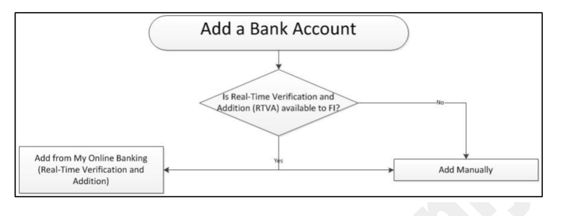
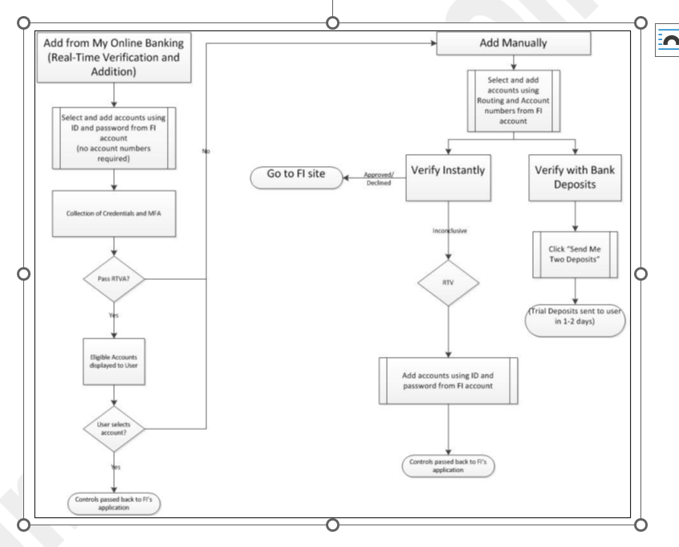

## Account Verification Flows

VerifyNow offers two flows to add and verify account ownership that can be pre-determined by the client or determined by the user.

•	When a user wants to add an account without having account information (e.g., routing numbers, account numbers), they can add the account via Real-Time Verification and Addition (RTVA).

•	When a user wants to add an account with account information, they will go through the manual account addition flow, which has a pre-determined verification waterfall beginning with Instant Verification.

Below shown figures explain the overview of the verification and addition process.

 

 &nbsp;

 

 &nbsp;

