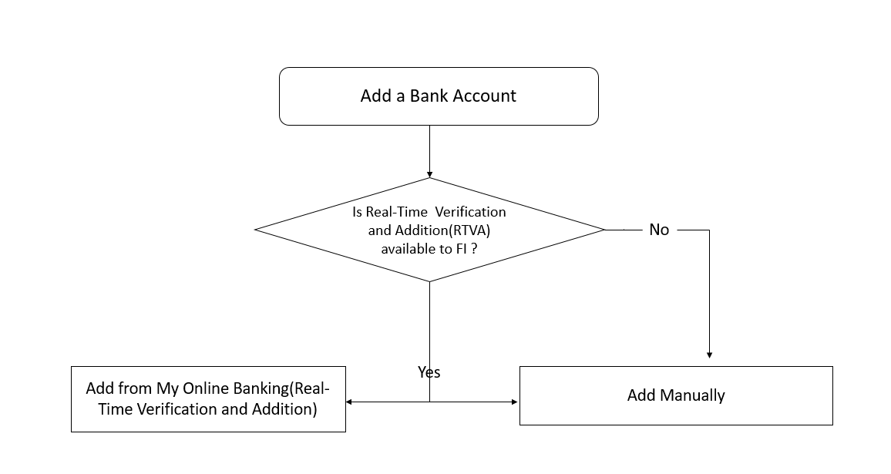

## Add Account Manually

The add account manually flow uses a pre-defined waterfall of verification methods based on what verification methods are enabled for the client. The verification waterfall begins with Instant Verification followed by Real Time Verification (when the financial institution is eligible), then/or Trial Deposits.

&nbsp;

### When the Add Account Manually Flow is Triggered

The following flow is applicable when:

<ul>
<li>Client has disabled RTVA via the DGF, or</li>
<li>Account and Routing Number are passed in the API invoking the widget, or</li>
<li>User has selected “Add Account Manually” within the Automated Add Account flow, or</li>
<li>RTVA is FALSE in the API. Please see the <a href="../docs/?path=docs/verifynow-account-verification-method.md">VerifyNow - Account Verification Methods </a> for more details.</li>
</ul>

## See Also
[Automated Account Addition](?path=docs/automated-account-additions.md) 
[User workflow](?path=docs/user-workflow.md) 
[Account Verification status/Exit points](?path=docs/account-verification-status.md) 
[CSS Integration](?path=docs/css-integration.md)
 