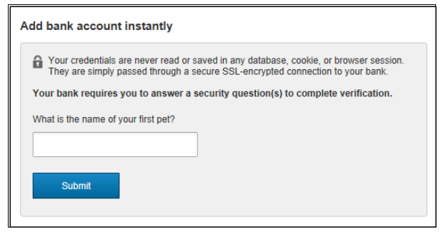

## Add Account Manually

The Add account manually flow uses a pre-defined waterfall of verification methods based on what verification methods are enabled for the client. The verification waterfall begins with Instant Verification followed by Real Time Verification (when the financial institution is eligible), then/or Trial Deposits.

&nbsp;

### When the Add Account Manually Flow is Triggered

The following flow is applicable when:

<ul>
<li>Client has disabled RTVA via the DGF, or</li>
<li>Account and Routing Number are passed in the API invoking the widget, or</li>
<li>User has selected “Add Account Manually” within the Automated Add Account flow, or</li>
<li>RTVA is FALSE in the API. See the step-by-step instructions below for Real-Time Verification (Widget Flow).</li>
</ul>

### Step-by-Step Instruction for Real-Time Verification

1.	The client system collects account information from the user prior to initiating the widget. The client system passes the information collected from the user to VerifyNow.
                         
2.	Instant Verification will be attempted first when enabled. The following Step occurs when Instant results are inconclusive, or Instant is not enabled. 

3.	VerifyNow offers the user the option to select the Real-time verification method or the Trial Deposit verification method.

4.	If the user selects the Real-time verification method (“Verify your bank account instantly”), VerifyNow initiates Real-time verification.  (If the user selects the Trial Deposit verification method (“Verify with bank deposits”), VerifyNow initiates Trial Deposit verification). Please see [Trial Deposit Verification](?path=docs/verifynow-account-verification-method/trial-deposit-verification.md) for more information.

5.	The user is asked to provide their username and password for the online banking portal where the user accesses their account.

6.	If multi-factor authentication (MFA) is required, the user is asked to provide additional information.

7.	If the user is verified, VerifyNow displays the Real-time verification in-progress screen to the user.

8.	Real-time verification is completed.
9.	VerifyNow passes control back to the client system, along with the verification decision.
10.	If the user is not approved, VerifyNow checks if the Trial Deposit verification method is available, and if available, gives the user the option to use Trial Deposit verification.

## See Also
[Automated Account Addition](?path=docs/automated-account-additions.md) 
[User workflow](?path=docs/user-workflow.md) 
[Account Verification status/Exit points](?path=docs/account-verification-status.md) 
[CSS Integration](?path=docs/css-integration.md)

 