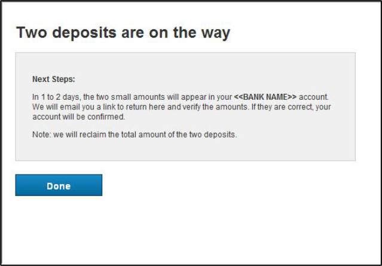

## Add Account Manually

The Add account manually flow uses a pre-defined waterfall of verification methods based on what verification methods are enabled for the client. The verification waterfall begins with Instant Verification followed by Real Time Verification (when the financial institution is eligible), then/or Trial Deposits.

&nbsp;

### When the Add Account Manually Flow is Triggered

The following flow is applicable when:

<ul>
<li>Client has disabled RTVA or Account and Routing Number are passed in the API invoking the widget, or
User has selected “Add Account Manually” within the Automated Add Account flow. </li>
</ul>

### Step-by-Step Instruction for Add Account Manual Flow

1.	The client system collects account information from the user prior to initiating the widget. The client system passes the information collected from the user to VerifyNow.

                         
2.	Instant Verification will be attempted first when enabled and Instant Verification in progress screen is displayed 

3.	If Instant Verification is inconclusive, VerifyNow offers the user the option to select the Real-time verification method or the Trial Deposit verification method.

4.	Real Time Verification
        

        <ul>
        <li>The user is asked to provide their username and password for the online banking portal where the user accesses their account or is given an option to manually verify using Trial Deposits</li>
        

        </ul>
 

 
        

        <ul>
        <li>If the user is verified, VerifyNow displays the Real-time verification in-progress screen to the user.</li>
        </ul>
        

    
        

        <ul>
        <li>Real-time verification is completed.</li>
        <li>VerifyNow passes control back to the client system, along with the verification decision.</li>
        <li>If the user is not approved, VerifyNow checks if the Trial Deposit verification method is available, and if available, gives the user the option to use Trial Deposit verification.</li>
        </ul>
        

5.	Trial Deposit Verification
        

        <ul>
        <li>To use Trial Deposit Verification, the user clicks the Send Me Two Deposits button.</li>

        <li>The user clicks the Done button to complete the process.</li>

        </ul>
        

 

## See Also
[Automated Account Addition](?path=docs/automated-account-additions.md) 
[User workflow](?path=docs/user-workflow.md) 
[Account Verification status/Exit points](?path=docs/account-verification-status.md) 
[CSS Integration](?path=docs/css-integration.md)

 