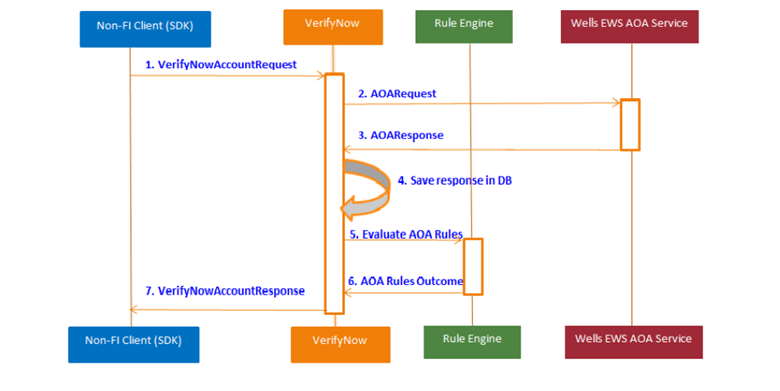

# API flow

The Verify Account API verifies the users bank account instantly. For verifying the user bank account, VerifyNow uses EWS 4.0 Instant Account Verification API. After a response is received from EWS, the Verify Account API runs the internal Fiserv account verification rules and returns the account verification details in the response to the calling application. This is a purely REST API implementation and one-step process.

<table border="1">
<tr style="background-color:#bfbfbf">
<th>Verification Method</th>
<th>Description</th>
<th>User Interaction and Ease</th>
</tr>
<tr>
<td>EWS 4.0 Instant Account Verification</td>
<td>Matches customer’s profile and bank account details like routing and account number combination.</td>
<td><b>No Interaction, High Ease</b> – User simply provides profile and bank routing and account number details.</td>
</tr>
</table>

The following sequence diagram shows the flow for the Verify Account API Integration.

