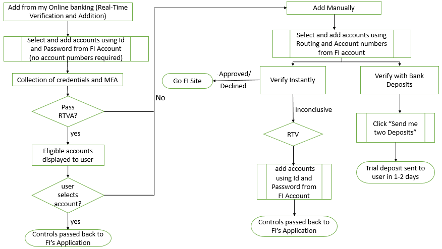
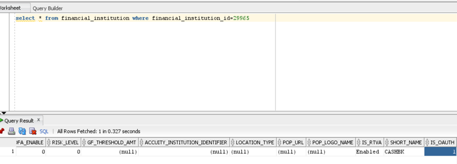
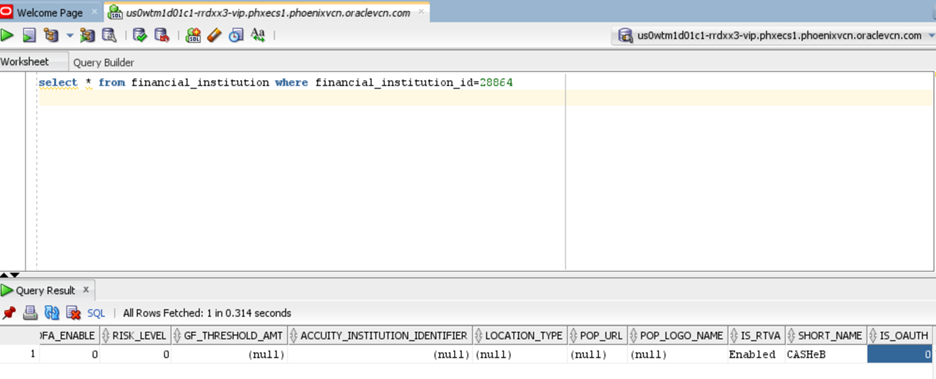

## Automated Account Addition

For eligible FIs, VerifyNow allows user to add accounts without providing information such as routing or account numbers. Instead, they may use Real-Time Verification and Addition, as described below.

&nbsp;

#### When the Automated Account Flow is Triggered

The following flow is applicable when:

<ul>
<li>Client has enabled RTVA via the DGF</li>

&nbsp;

<li>Account and Routing Number are NOT passed in the API invoking the widget</li>

<li>RTVA is not FALSE in the API.</li>
</ul>

&nbsp;

<!-- theme: info -->
 
>**Note**   Even when RTVA is enabled, users can choose to add any account manually.

When a user tries to add an account for the FI via RTVA, they provide credentials for logging into the external FI. The user is put through Multi-Factor Authentication (MFA). Then account-related information is successfully scraped, and the name is passed through risk rules for matching logic to determine whether the accounts should be displayed to the user or not. If the information fails the check, the user is sent to add the account manually (see [Add Account Manually](?path=docs/add-account-manually.md)).

The name that comes in SSO will be compared against the name scraped by Aggregation. Risk rules for name matching determine if the account information should be displayed to the user.

    <input type="checkbox" class="collapsible-checkbox" id="section1">
    <label class="label-expand" for="section1">Automated Account Addition Flow for Oath Users</label>
    

&nbsp;

<!-- theme: info -->
 
>**Note**   The following steps are applicable to Financial Institutions that is Oath Enabled.

&nbsp;

1.	Click the appropriate icon, or type in the search box to choose the Financial Institution.

        

            
        

        

            
        

2.	Once the respective financial institution is selected, the user will be navigated to the Oath authentication screen.

&nbsp;

3.	Click Authenticate.

4.	Enter the login credentials to sign-in.

&nbsp;

5.	Then the user is navigated to the multifactor authentication screen.

&nbsp;

6.	Once the details are added, click Submit.

7.	Select the account in the Consent Page. 

&nbsp;

8.	Click Authorize.

9.	Pop-up screen appears as shown below.

&nbsp;

10.	Once the user successfully authenticates with the financial institution, they will need to choose which account(s) to add.

&nbsp;

11.	Clicking the Add button will complete the verification flow.

    

    <ul>
    <li>Selecting “Add your account manually” will take the user to the add account manually flow. </li>
    </ul>
    

 

    <input type="checkbox" class="collapsible-checkbox" id="section2">
    <label class="label-expand" for="section2">Automated Account Addition Flow for Non-Oath Users</label>
    

&nbsp;

<!-- theme: info -->
 
>**Note**   The following steps are applicable to Financial Institutions that are not Oath Enabled.

&nbsp;

1.	Click the appropriate icon, or type in the search box to choose the Financial Institution.    

    

        

            
        

        

            
        

    

2.	Here, the user will have the option of adding from their online banking website or adding an account manually.

&nbsp;

        <ul>
            <li>To use Real-Time Verification and Addition, the user will enter the User ID and Password for their bank account and click the Submit button. </li>
            <li>To add an account manually, the user will click the Add Account Manually button. </li>
        </ul>

3.	Once the user successfully authenticates with the financial institution, they will need to choose which account(s) to add.

&nbsp;

4.	Clicking the Add button will complete the verification flow.

    a.	Selecting “Add your account manually” will take the user to the add account manually flow.

### See Also

[Add Account Manually](?path=docs/add-account-manually.md) 
[User workflow](?path=docs/user-workflow.md) 
[Account Verification status/Exit points](?path=docs/account-verification-status.md) 
[CSS Integration](?path=docs/css-integration.md)

