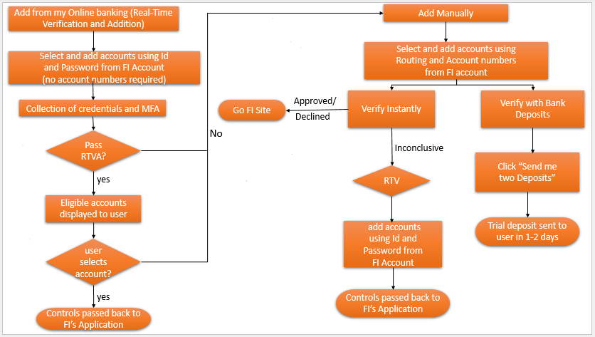
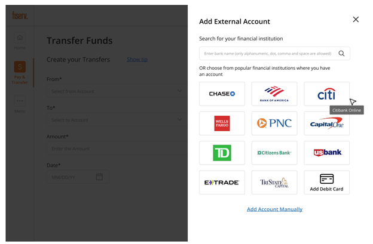
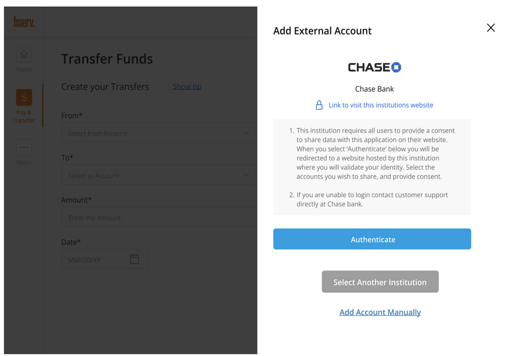
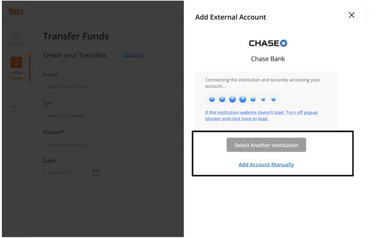
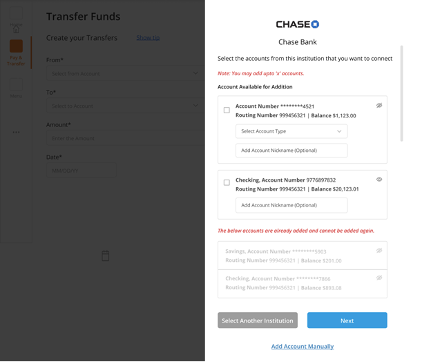

## Automated Account Addition

For eligible FIs, VerifyNow allows user to add accounts without providing information such as routing or account numbers. Instead, they may use Real-Time Verification and Addition, as described below.

## Real-Time Verification and Addition (RTVA)

When a user tries to add an account for the FI via RTVA, they provide credentials for logging into the external FI. The user is put through Multi-Factor Authentication (MFA). Then account-related information is successfully scraped and the name is passed through risk rules for matching logic to determine whether or not the accounts should be displayed to the user. If the information fails the check, the user is sent to add the account manually (see [Add Account Manually](?path=docs/add-account-manually.md)).

The name that comes in SSO will be compared against the name scraped by Aggregation. Risk rules for name matching determine if the account information should be displayed to the user.

&nbsp;

## General Steps

Regardless of which verification method is used, the first few steps will be the same.

<h5 style="color:#ff6600">Note:</h5>

All forms of verification will not necessarily be available for all FIs. Users will have access to some or all verification methods, as applicable.

1.	Click the appropriate icon, or type in the search box.

&nbsp;

2.	Here, the user will have the option of adding from their online banking website or adding an account manually.

&nbsp;

3.  To use Real-Time Verification and Addition, the user will enter the User ID and Password for their bank account and click the Submit button.

&nbsp;

4.  User will need to choose to add an account fetched by Real Time Verification from external FI or user can choose to add an account manually if they are not able to find the account

&nbsp;

### See Also

[Add Account Manually](?path=docs/add-account-manually.md) 
[User workflow](?path=docs/user-workflow.md) 
[Account Verification status/Exit points](?path=docs/account-verification-status.md) 
[CSS Integration](?path=docs/css-integration.md)

