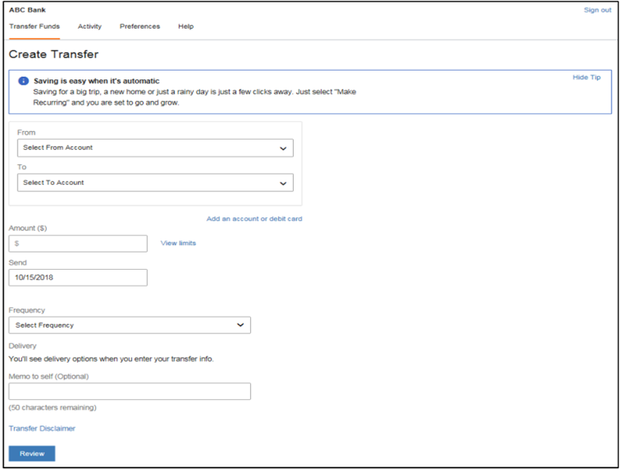
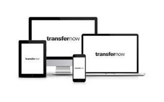
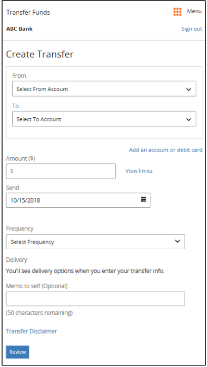
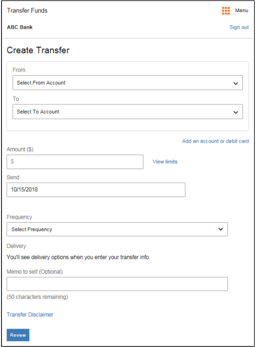
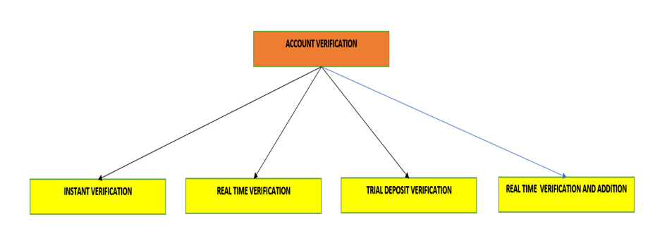
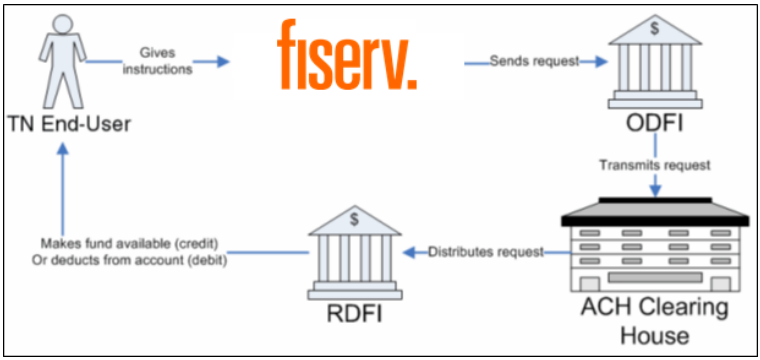

# Getting Started

This document provides details on how TransferNow application enables a FI to offer secure inter-institution funds transfer services by automating the authentication of external accounts and debit cards, provides a comprehensive risk management system, and moves fund using the Automated Clearing House (ACH), and other payment networks. Common use cases include:

-	Add, verify, and delete external ACH accounts and debit cards (supported by Visa) 
-	Create, edit, and cancel one-time scheduled and recurring transfers 
-	View all transfer activity 
-	Verify email addresses 
-	View limits and fees 
-	Validate limits

## SSL Log-In 

An FI passes users to Fiserv via Secure Sockets Layer (SSL) Secure Messaging. SSL Secure Messaging is a specialized form of authentication that enables a user to authenticate once and gain access to the resources of multiple software systems. 

When an FI passes users to Fiserv via SSL Secure Messaging, Fiserv routes them to the TN landing page, which is the Transfer Funds Overview screen. Refer to Figure 5 below.

<!-- align: center -->

Transfer Now Overview Screen

Whenever Fiserv receives a user via SSL Secure Messaging, the user’s profile is registered in the Fiserv ePayments database. The profile establishes a unique identifier called <>. 

<!-- theme: info -->
> #### Note
>
> A unique TransferNow user is defined by last name, social security number, and date of birth. All users with matching information for these fields are considered the same user in TransferNow.

When a user is passed to Fiserv with an identifier that already exists in the Fiserv ePayments database, Fiserv treats them as a returning user. If the identifier does not exist, then Fiserv treats them as a new user, and registers the profile in the Fiserv ePayments database.

## Transfer Now Login

**Transfer Now can be deployed in one of the following ways:**

- User Logging in via the Single Sign-On integration between Fiserv and the client partner (any Financial Institution) using the standard Fiserv ePayments user interface. 

- XML API integration with the respective Financial Institution web pages that support the service.

## Responsive Web Design

TransferNow implements Responsive Web Design, which optimizes the user experience by accommodating a range of differently sized screens, such as those used for standard mobile phones, for plus-sized mobile phones, and for laptops, desktops, and tablets.

Responsive Web Design detects and adapts to the screen size of the user’s device, presenting a display format that best matches the device’s screen size. This is achieved in part through breakpoints (or breakpoint ranges)—sizes or size ranges, measured in pixels, that are specified as the points at which the display changes, depending on and adapting to the size of the device’s screen. 

 ``RESPONSIVE UI SCREENS``

<!-- align: center 

-->

Responsive Web Design detects and adapts to the screen size of the user’s device, presenting a display format that best matches the device’s screen size.

This is achieved in part through breakpoints (or breakpoint ranges)—sizes or size ranges, measured in pixels, that are specified as the points at which the display changes, depending on and adapting to the size of the device’s screen.

> :memo: **Note:** The screenshot samples in this document are strictly representational; they are provided as examples only.

> :memo: **Note:** There are differences between the mobile-focused and desktop user interfaces. Most of the screenshot samples in this document are desktop-focused, unless otherwise specified.

  ``320*479 Pixel BreakPoint For Mobile Phones`` 

 ``480*767 Pixel BreakPoint For Mobile Phones`` 

  ``700 Plus Pixel Breakpoint For Larger Screens``

There is persistent navigation, located at the top or left-hand side of the screen for the breakpoint (768 plus pixels) optimized for larger screens (such as those used for desktops, laptops, and tablets) and this is a client-configurable option; and the content is generally left-aligned and wider. 
For the breakpoints at 480 and below, some functions are hidden, disabled or collapsed.

## Adding an Account

A TransferNow user may add a bank/credit union account or brokerage account as an account eligible for funds transfers. The user adds one account at a time, specifying the account type, account number, and ABA routing number.

Accounts require verification of account ownership, as described in Account Verification. To add a bank/credit union account, the user searches a database of over 23,000 institutions by ABA number.

To add a brokerage institution, the user selects from the following list of supported brokerages:

-	Ameriprise Financial®
-	Charles Schwab®
-	E-Trade
-	Fidelity Investments®
-	Merrill Lynch®
-	Morgan Stanley®
-	Principal® Funds Money Market
-	Scottrade, Inc. ®
-	Smith Barney®
-	TD Ameritrade®

## Account Verification

TransferNow verifies a user’s ownership of an external account using four types of account verification:   

*	Instant
*	Real-time
*	Trial-deposit 
*	Real Time Verification and Addition

<!-- theme: info -->
> ###### Note
>
> Clients have the option to allow Outbound Transfers (Transfer to a third-party account) to unverified external accounts, subject to a client-specified dollar limit. By default, verification is ON.

 Account Verification

## External Transfers with TransferNow

TransferNow provides the user with access to ``23,000 banks``, credit unions, and brokerages for which accounts can be added. The user searches for an institution and uses the appropriate data collection screens based on the services available for the selected institution. 

Users can create one-time and recurring transfers and can schedule them for standard (three day) or next-day delivery. Users can also create one-time transfers for instant delivery through use of real-time connectivity offered by the NOW Network. 

Users can edit transfers that have not been sent to ACH. 
For account transfers, TN uses the Automated Clearing House (ACH) network to process electronic transactions. 

*	TN can process transfers returned for reasons such as non-sufficient funds and invalid account numbers 

*	TN automatically suspends user accounts based on certain return transactions from ACH, and can enforce suspensions on an account and user level.

## ACH Processing

TN uses the Automated Clearing House (ACH) network to process electronic transactions. TN follows the standard ACH procedure:

*	The TN end-user initiates the process by providing instructions for an electronic transaction.

*	TN sends all transaction instructions in a batch file to an Originating Depository Financial Institution (ODFI).

*	The ODFI forwards the information to the ACH operator.

*	Finally, the ACH Operator sends the information to the Receiving Depository Financial Institution (RDFI).

A complete money transfer comprises two transactions: a debit transaction to withdraw money from the source account and a credit transaction to deposit money into the destination account. The transfer is complete when both transactions have processed successfully. When an RDFI cannot process a transaction, due to various reasons, the RDFI issues a return to the ODFI.

TN supports two ACH transaction methods: 

*	Good Funds Model (GFM)
*	Next Day Transfers (NDT)

A transaction processed via the GFM has less risk associated with it, because TN waits until the debit transaction completes successfully before initiating the credit transaction. On the other hand, for a NDT transaction, TN initiates both the credit and the debit transaction at the same time.

  ACH Processing

>
>
> Note: TN offers automated emails for clients to send to users to keep them informed of the progress of the ACH transaction.

 
