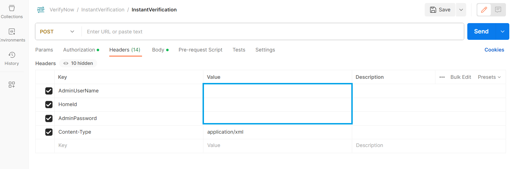

<!-- 
type: tab 
titles: Before You Start, Know Our Standard API Structure, Make Your First API Call
-->


# Before You Start

<!-- theme: info -->

> :memo: _**Note:**  <br/>The current user journey enables developers to access to a range of APIs on VerifyNow._

  
Before you start integration, it is important to register on the Fiserv Developer Studio to test the VerifyNow APIs in the Sandbox environment. You may choose to test APIs <a href="?path=docs/getting-started/make-your-first-api-call.md#using-third-party-api-testing-tools" >Using  Third-party API Testing Tools</a> of your choice. However, registration is not required to learn about our APIs and reference documentations.
<!--

[![Video Thumbnail]][Video]  

-->

<!--[![Video Thumbnail]][Video1]  

[Video]: https://user-images.githubusercontent.com/81968767/231950346-2b13475d-f395-4b11-8a55-2d0c93f45813.mp4
[Video Thumbnail]: https://user-images.githubusercontent.com/81968767/232030323-bbde320a-2bf5-4e21-97c0-8fe1a8895913.png

[Video1]: https://github.com/Fiserv/banking-hub/assets/81706748/a776e7c8-bea8-410e-9529-43ca3968327d-->


## Register on Fiserv Developer Studio
This section describes the process to create an account on Fiserv Developer Studio to obtain credentials for sandbox testing.

### Creating an Account

Perform the following steps to create an account on Fiserv Developer Studio:
1.	From the top-right corner of the screen, click **Create account**.
2.	Populate the required fields and click **Next**.
3.	Follow the instructions on the screen to set up your account.
4.	Sign in to your Fiserv Developer Studio account once it is activated.


<a href="#tab-know_our_standard_api_structure" >Next - Know Our Standard API Structure</a>


<!-- type: tab -->


# Know Our Standard API Structure 

This section describes a standard structure of request and response message of VerifyNow RESTful APIs. 

## Request Message

All API requests must contain the following components:
<div class="card-body">
<ul>
<li>API Method</li>
<li>Request URL</li>
<li>Request Header</li>
<li>Request Body</li>
</ul>
</div>

For every API request, a response message is obtained that contains a response payload and the status of the API request.

<div class="collapsible-container">
<div>
   <input type="checkbox" class="collapsible-checkbox" id="section1">
    <label class="label-expand" for="section1">API Method</label>
    <div class="content-expand">
    <p>For security reasons, all API methods are set to POST or PUT, irrespective of the operation.</p>
    </div>
    </div>
    </br>
    <div>
    <input type="checkbox" class="collapsible-checkbox" id="section2">
    <label class="label-expand" for="section2">Request URL</label>
    <div class="content-expand">
    <p>Request URL is formed by appending Host URL and API path.</p>
    <h4>Request URL = Host URL + API path</h4>
    <p>The API path along with the method (POST or PUT) is listed under the API Explorer section of that API on Fiserv Developer Studio.Refer the following example to construct a request URL for <a href="../api/?type=post&path=/cashedgerws/verifynow/verify/v1">VerifyNow</a> API:</p>
     
     <p>If host URL of the product is https://qa-ft.onefiserv.net, then request URL will be:</p>
     
    </div>
    </div>
    </br>
    <div>
    <input type="checkbox" class="collapsible-checkbox" id="section3">
    <label class="label-expand" for="section3">Request Header</label>
    <div class="content-expand">
    <p>Header parameters are common for all API requests of VerifyNow APIs.</p>
    <h4>Sample Header Example</h4>
<pre>
 <code>
"requestHeaders": [
							{
								"key": "AdminUserName",
								"value": "string"								
							},
							{
								"key": "AdminPassword",
								"value": "string"	
							},
							{
								"key": "HomeId",
								"value": "string"								
							},
							{
								"key": "Content-Type",
								"value": "application/json"
							}
						]
</code>
</pre>
   </div>
    </div>
    </br>
    <div>
    <input type="checkbox" class="collapsible-checkbox" id="section4">
    <label class="label-expand" for="section4">Request Body</label>
    <div class="content-expand">
    <p>The request body of an API changes based on the type of request being processed. Request body contains the detailed information that is required to perform a particular type of request.</p>
    <h4>Request Payload</h4>
    <p>The following example shows the sample request payload for <b>VerifyNow</b> API request.</p>
    <pre>
    <code>
    {
  "VerifyNowRequest": {
    "requestId": "string",
    "profile": {
      "email": "string",
      "firstName": "string",
      "lastName": "string",
      "userId": "string"
    },
    "profileDetails": {
      "ssn": "string",
      "address": {
        "addressLine1": "string",
        "city": "string",
        "state": "string",
        "zipCode": "string"
      },
      "phoneNumber": "string"
    },
    "accountOwnershipVerification": {
      "instantVerification": {
        "enable": "string"
      },
      "trialDepositVerification": {
        "enable": "string"
      }
    }
  }
}
</code>
</pre>
    </div>
    </div>
    </div>

<!--### API Method

For security reasons, all API methods are set to POST or PUT, irrespective of the operation. 

### Request URL

Request URL is formed by appending Host URL and API path. 


 theme: info 
 **Request URL = Host URL + API path**


The API path along with the method (POST or PUT) is listed under the API Explorer section of that API on Fiserv Developer Studio. 
Refer the following example to construct a request URL for [**verify now**](../api/?type=post&path=/cashedgerws/verifynow/verify/v1) API:


If host URL of the product is https://qa-ft.onefiserv.net, then request URL will be:


### Request Header
  
  
Header parameters are common for all API requests of Verify Now APIs. 

**Sample Header Example**
```
"requestHeaders": [
							{
								"key": "AdminUserName",
								"value": "string"								
							},
							{
								"key": "AdminPassword",
								"value": "string"	
							},
							{
								"key": "HomeId",
								"value": "string"								
							},
							{
								"key": "Content-Type",
								"value": "application/json"
							}
						]

```

### Request Body

The request body of an API changes based on the type of request being processed. Request body contains the detailed information that is required to perform a particular type of request.

**Request Payload** 

The following example shows the sample request payload for **verify now** API request.

```
{
  "VerifyNowRequest": {
    "requestId": "string",
    "profile": {
      "email": "string",
      "firstName": "string",
      "lastName": "string",
      "userId": "string"
    },
    "profileDetails": {
      "ssn": "string",
      "address": {
        "addressLine1": "string",
        "city": "string",
        "state": "string",
        "zipCode": "string"
      },
      "phoneNumber": "string"
    },
    "accountOwnershipVerification": {
      "instantVerification": {
        "enable": "string"
      },
      "trialDepositVerification": {
        "enable": "string"
      }
    }
  }
}
```
 -->


## Response Message

Upon a successful API request, a response payload is received. The response payload contains the status and the returned details of the requested API in JSON. The default response format is JSON.


<div class="collapsible-container">
<div>
   <input type="checkbox" class="collapsible-checkbox" id="section5">
    <label class="label-expand" for="section5">Response Payload</label>
    <div class="content-expand">
    <p>The following example shows the sample response payload for <b>VerifyNow</b> API request.</p>
    <pre>
    <code>
    {
    "requestId" : "string",
    "token" : "string",
    "profileInfo" : {
        "profileId" : "string",
        "profileStatus" : "string"
    },
    "status" : {
        "statusCode" : "string",
        "statusDesc" : "string",
        "statusType" : "string"
}
}
    </code>
    </pre>
    <p>To view the API documentation of <b>VerifyNow</b> API in API Explorer, <a href="../api/?type=post&path=/cashedgerws/verifynow/verify/v1">click here</a></p>
    </div>
    </div>
    </br>
    </div>
     

<!-- ### Response Payload

The following example shows the sample response payload for **verify now** API request.

```
{
    "requestId" : "string",
    "token" : "string",
    "profileInfo" : {
        "profileId" : "string",
        "profileStatus" : "string"
    },
    "status" : {
        "statusCode" : "string",
        "statusDesc" : "string",
        "statusType" : "string"
}
}
```

To view the API documentation of **verify now** API in API Explorer, [click here](../api/?type=post&path=/cashedgerws/verifynow/verify/v1).-->


 [Next - Make Your First API Call](#tab-make_your_first_api_call) 


<!-- type: tab -->


# Make Your First API Call

This section describes the process to send an API request to the server and receive a response payload. To test the APIs, use the third-party API testing tool.

## Using Third-Party API Testing Tools

You can test our APIs in the Sandbox environment using third-party API testing tools, such as Postman, Apigee, JMeter and others.


<!-- theme: info -->

> _**Tip**  <br> We recommend you to refer to the <a href="?path=docs/getting-started/know-our-standard-api-structure.md#know-our-standard-api-structure" title="Click to open">Know Our Standard API Structure</a> section to understand the API structure prior to testing the APIs in any third-party tool._


### Prerequisites
To make an API call, you need:
<div class="card-body">
<ul>
<li> An active user account on Fiserv Dev Studio.</li>
</ul>
</div>

**Creating an account on Dev Studio**


To create an account on Fiserv Developer Studio, refer to the [Register on Fiserv Developer Studio](?path=docs/getting-started/before-you-start.md#register-on-fiserv-developer-studio) section. 


### Example
  
The following example illustrates the process to test an API using Postman application:
  
  
Postman is a client that lets you test RESTful APIs. If you are familiar with Postman, refer to the following steps to test Fiserv APIs in the sandbox environment. 
  
<!-- theme: info -->  

> _**Recommendation**  <br> Keep the API documentation accessible to refer to the default request-payload for the request message._


<div class="collapsible-container">
<div>
   <input type="checkbox" class="collapsible-checkbox" id="section6">
    <label class="label-expand" for="section6">Prerequisite to run Postman collection</label>
    <div class="content-expand">
    <p>To  test an API using Postman application: </p>
    <p>1. Open a web or desktop application of Postman.</p>
    <p>2.	Create a new HTTP request.</p>
    <p>3.	Set the API method to POST or PUT, as mentioned in the API document which you want to test. </p>
    <p class="block-quote">Note: <br/>API method of all Fiserv APIs is either set to POST or PUT for all operations.</p>
    <p>4.	Insert the request URL. </p>
    <p>5.	Add Header as new parameters under the <b>Headers</b> section and insert the value in JSON format.</p>
    <p>6.	Insert the request-payload under the <b>Body</b> tab. Make sure that the <b>raw</b> radio button is activated and the text format is set to <b>JSON</b>.</p>
    <br>
    <p class="block-quote">Note: <br/>Default request-payload can be copied from the API Explorer document and you may modify certain fields as mentioned in the documentation.</p>
    <p>7.	Modify the field values in JSON code that you want to test.</p>
    <p>8. Click <b>Send</b>. API response is generated in the Response section.</p>
    </div>
    </div>
    </br>
    </div>
    

<!--#### Prerequisite to run Postman collection


To  test an API using Postman application: 

1. Open a web or desktop application of Postman.
2.	Create a new HTTP request.
3.	Set the API method to POST or PUT, as mentioned in the API document which you want to test. 
   
    #### Note
    
  API method of all Fiserv APIs is either set to POST or PUT for all operations.

4.	Insert the request URL.     
5.	Add Header as new parameters under the **Headers** section and insert the value in JSON format.
6.	Insert the request-payload under the **Body** tab. Make sure that the **raw** radio button is activated and the text format is set to **JSON**. 
  
    <kbd></kbd><br>
    
    
    > #### Note
    >
    > Default request-payload can be copied from the API Explorer document and you may modify certain fields as mentioned in the documentation.
  
7.	Modify the field values in JSON code that you want to test. 
8.	Click **Send**. API response is generated in the Response section. -->

<div class="collapsible-container">
<div>
   <input type="checkbox" class="collapsible-checkbox" id="section7">
    <label class="label-expand" for="section7">Step 1:  Enter Host Url</label>
    <div class="content-expand">
    
    </div>
    </div>
    </br>
    <div>
    <input type="checkbox" class="collapsible-checkbox" id="section8">
    <label class="label-expand" for="section8">Step 2: Enter Header values</label>
    <div class="content-expand">
    
    </div>
    </div>
    </br>
    <div>
    <input type="checkbox" class="collapsible-checkbox" id="section9">
    <label class="label-expand" for="section9">Step 3: Request Payload</label>
    <div class="content-expand">
    
    </div>
    </div>
    </br>
    <div>
    <input type="checkbox" class="collapsible-checkbox" id="section10">
    <label class="label-expand" for="section10">Step 4: Response Payload</label>
    <div class="content-expand">
    
    </div>
    </div>
    </br>
    </div>


<!--#### STEP 1:

Enter Host Url.


#### STEP 2:

Enter Header values. 

R

#### STEP 3:

Request Payload.


#### STEP 4:

Response Payload.

-->
  
  

<!-- type: tab-end -->


<style>

    .collapsible-container {
        width: 100%;
    }


    .collapsible-checkbox {
        display: none;
    }

    .label-expand {
        background-color: #777;
        color: white;
        cursor: pointer;
        padding: 18px;
        width: 100%;
        border: none;
        text-align: left;
        outline: none;
        font-size: 15px;
        display: block;
    }

    .collapsible-checkbox:checked+.label-expand {
        background-color: #555;
    }

    .content-expand {
        padding: 0 18px;
        display: none;
        overflow: hidden;
        background-color: #f1f1f1;
    }

    .collapsible-checkbox:checked+.label-expand+.content-expand {
        display: block;
    }

    .block-quote {
        padding: 1em;
        color: #6a737d;
        border-left: 0.375em solid #40a9ff;
        background: #e6f7ff;
        border-radius: 3px;
    }

    .content-left {
        width: 50%
    }

    .image-otp {
        width: 40%
    }

    .content-body {
        display: flex;
        align-items: center;
        justify-content: space-between;
        padding: 20px;
    }

    .image-center {
      display: block;
      margin-left: auto;
      margin-right: auto;
      width: 70%;
    }
    
    .card-body {
        margin: 20px;
    }
    .card-body ul {
        list-style: none;
        padding-left: 20px;
    }
    .card-body ul li::before {
        content: "\2022";
        font-size: 1em;
        color: #f60;
        display: inline-block;
        width: 1em;
        margin-left: -1em;
    }
    .markdown-body pre{
     background-color: #FFFFFF;
    }
</style>

