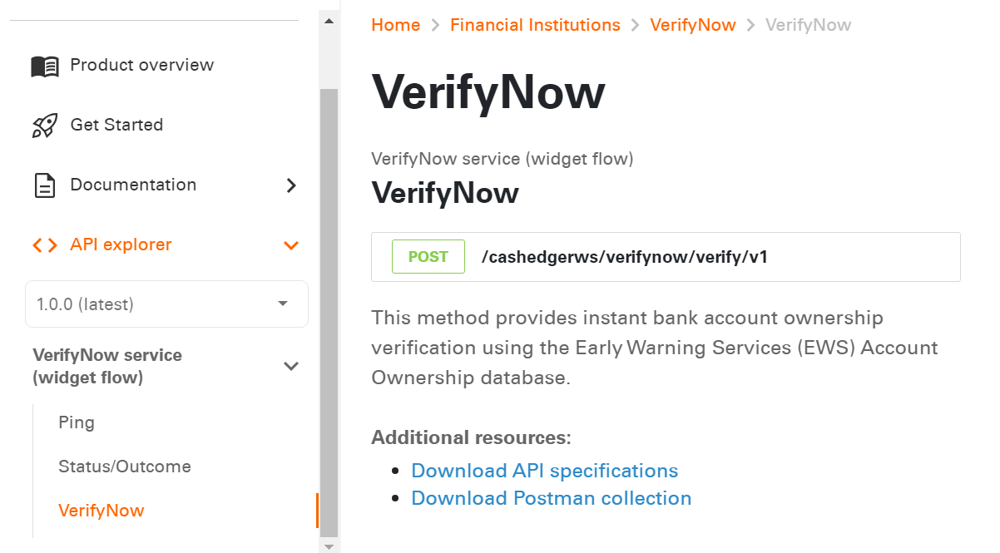

# Know Our Standard API Structure 

This section describes a standard structure of request and response message of VerifyNow RESTful APIs. 

## Request Message

All API requests must contain the following components:
<div class="card-body">
<ul>
<li>API Method</li>
<li>Request URL</li>
<li>Request Header</li>
<li>Request Body</li>
</ul>
</div>

For every API request, a response message is obtained that contains a response payload and the status of the API request.

<div class="collapsible-container">
<div>
   <input type="checkbox" class="collapsible-checkbox" id="section1">
    <label class="label-expand" for="section1">API Method</label>
    <div class="content-expand">
    <p>For security reasons, all API methods are set to POST or PUT, irrespective of the operation.</p>
    </div>
    </div>
    </br>
    <div>
    <input type="checkbox" class="collapsible-checkbox" id="section2">
    <label class="label-expand" for="section2">Request URL</label>
    <div class="content-expand">
    <p>Request URL is formed by appending Host URL and API path.</p>
    <h4>Request URL = Host URL + API path</h4>
    <p>The API path along with the method (POST or PUT) is listed under the API Explorer section of that API on Fiserv Developer Studio.Refer the following example to construct a request URL for <a href="../api/?type=post&path=/cashedgerws/verifynow/verify/v1">VerifyNow</a> API:</p>
     
     <p>If host URL of the product is https://qa-ft.onefiserv.net, then request URL will be:</p>
     
    </div>
    </div>
    </br>
    <div>
    <input type="checkbox" class="collapsible-checkbox" id="section3">
    <label class="label-expand" for="section3">Request Header</label>
    <div class="content-expand">
    <p>Header parameters are common for all API requests of VerifyNow APIs.</p>
    <h4>Sample Header Example</h4>
 <pre>
 <code> 
"requestHeaders": [
							{
								"key": "AdminUserName",
								"value": "string"								
							},
							{
								"key": "AdminPassword",
								"value": "string"	
							},
							{
								"key": "HomeId",
								"value": "string"								
							},
							{
								"key": "Content-Type",
								"value": "application/json"
							}
						]
</code>            
</pre>
   </div>
    </div>
    </br>
    <div>
    <input type="checkbox" class="collapsible-checkbox" id="section4">
    <label class="label-expand" for="section4">Request Body</label>
    <div class="content-expand">
    <p>The request body of an API changes based on the type of request being processed. Request body contains the detailed information that is required to perform a particular type of request.</p>
    <h4>Request Payload</h4>
    <p>The following example shows the sample request payload for <b>VerifyNow</b> API request.</p>
    <pre>
   <code>
    {
  "VerifyNowRequest": {
    "requestId": "string",
    "profile": {
      "email": "string",
      "firstName": "string",
      "lastName": "string",
      "userId": "string"
    },
    "profileDetails": {
      "ssn": "string",
      "address": {
        "addressLine1": "string",
        "city": "string",
        "state": "string",
        "zipCode": "string"
      },
      "phoneNumber": "string"
    },
    "accountOwnershipVerification": {
      "instantVerification": {
        "enable": "string"
      },
      "trialDepositVerification": {
        "enable": "string"
      }
    }
  }
}
</code>
</pre>
    </div>
    </div>
    </div>

<!--### API Method

For security reasons, all API methods are set to POST or PUT, irrespective of the operation. 

### Request URL

Request URL is formed by appending Host URL and API path. 


 theme: info 
**Request URL = Host URL + API path**


The API path along with the method (POST or PUT) is listed under the API Explorer section of that API on Fiserv Developer Studio. 
Refer the following example to construct a request URL for [**verify now**](../api/?type=post&path=/cashedgerws/verifynow/verify/v1) API:




If host URL of the product is https://qa-ft.onefiserv.net, then request URL will be:


### Request Header
  
  
Header parameters are common for all API requests of Verify Now APIs. 

**Sample Header Example**
```
"requestHeaders": [
							{
								"key": "AdminUserName",
								"value": "string"								
							},
							{
								"key": "AdminPassword",
								"value": "string"	
							},
							{
								"key": "HomeId",
								"value": "string"								
							},
							{
								"key": "Content-Type",
								"value": "application/json"
							}
						]

```

### Request Body

The request body of an API changes based on the type of request being processed. Request body contains the detailed information that is required to perform a particular type of request.

**Request Payload** 

The following example shows the sample request payload for **verify now** API request.

```
{
  "VerifyNowRequest": {
    "requestId": "string",
    "profile": {
      "email": "string",
      "firstName": "string",
      "lastName": "string",
      "userId": "string"
    },
    "profileDetails": {
      "ssn": "string",
      "address": {
        "addressLine1": "string",
        "city": "string",
        "state": "string",
        "zipCode": "string"
      },
      "phoneNumber": "string"
    },
    "accountOwnershipVerification": {
      "instantVerification": {
        "enable": "string"
      },
      "trialDepositVerification": {
        "enable": "string"
      }
    }
  }
}
```
-->


## Response Message

Upon a successful API request, a response payload is received. The response payload contains the status and the returned details of the requested API in JSON. The default response format is JSON. 


<div class="collapsible-container">
<div>
   <input type="checkbox" class="collapsible-checkbox" id="section5">
    <label class="label-expand" for="section5">Response Payload</label>
    <div class="content-expand">
    <p>The following example shows the sample response payload for <b>VerifyNow</b> API request.</p>
    <pre>
    <code>
    {
    "requestId" : "string",
    "token" : "string",
    "profileInfo" : {
        "profileId" : "string",
        "profileStatus" : "string"
    },
    "status" : {
        "statusCode" : "string",
        "statusDesc" : "string",
        "statusType" : "string"
}
}
    </code>
    </pre>
    <p>To view the API documentation of <b>VerifyNow</b> API in API Explorer, <a href="../api/?type=post&path=/cashedgerws/verifynow/verify/v1">click here</a></p>
    </div>
    </div>
    </div>
     </br>

<!-- ### Response Payload

The following example shows the sample response payload for **verify now** API request.

```
{
    "requestId" : "string",
    "token" : "string",
    "profileInfo" : {
        "profileId" : "string",
        "profileStatus" : "string"
    },
    "status" : {
        "statusCode" : "string",
        "statusDesc" : "string",
        "statusType" : "string"
}
}
```

To view the API documentation of **verify now** API in API Explorer, [click here](../api/?type=post&path=/cashedgerws/verifynow/verify/v1).-->


<style>

    .collapsible-container {
        width: 100%;
    }


    .collapsible-checkbox {
        display: none;
    }

    .label-expand {
        background-color: #777;
        color: white;
        cursor: pointer;
        padding: 18px;
        width: 100%;
        border: none;
        text-align: left;
        outline: none;
        font-size: 15px;
        display: block;
    }

    .collapsible-checkbox:checked+.label-expand {
        background-color: #555;
    }

    .content-expand {
        padding: 0 18px;
        display: none;
        overflow: hidden;
        background-color: #f1f1f1;
    }

    .collapsible-checkbox:checked+.label-expand+.content-expand {
        display: block;
    }

    .block-quote {
        padding: 1em;
        color: #6a737d;
        border-left: 0.375em solid #40a9ff;
        background: #e6f7ff;
        border-radius: 3px;
    }

    .content-left {
        width: 50%
    }

    .image-otp {
        width: 40%
    }

    .content-body {
        display: flex;
        align-items: center;
        justify-content: space-between;
        padding: 20px;
    }

    .image-center {
      display: block;
      margin-left: auto;
      margin-right: auto;
      width: 70%;
    }
    
    .card-body {
        margin: 20px;
    }
    .card-body ul {
        list-style: none;
        padding-left: 20px;
    }
    .card-body ul li::before {
        content: "\2022";
        font-size: 1em;
        color: #f60;
        display: inline-block;
        width: 1em;
        margin-left: -1em;
    }
    .markdown-body pre{
     background-color: #454545;
    }
</style>

