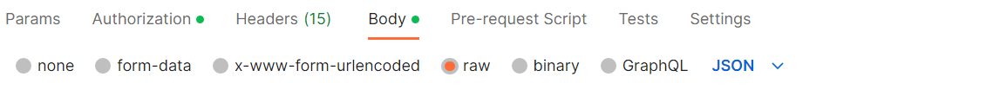

# Make Your First API Call

This section describes the process to send an API request to the server and receive a response payload. To test the APIs, use the third-party API testing tool.

## Using Third-Party API Testing Tools

You can test our APIs in the Sandbox environment using third-party API testing tools, such as Postman, Apigee, JMeter and others.

<!-- theme: info -->
> #### Tip
>
> We recommend you to refer to the <a href="?path=docs/getting-started/know-our-standard-api-structure.md#know-our-standard-api-structure" title="Click to open">Know Our Standard API Structure</a> section to understand the API structure prior to testing the APIs in any third-party tool.

### Prerequisites
To make an API call, you need:
- An active user account on Fiserv Dev Studio.

**Creating an account on Dev Studio**

To create an account on Fiserv Developer Studio, refer to the [Register on Fiserv Developer Studio](?path=docs/getting-started/before-you-start.md#register-on-fiserv-developer-studio) section. 

### Example
  
The following example illustrates the process to test an API using Postman application:
  
  
Postman is a client that lets you test RESTful APIs. If you are familiar with Postman, refer to the following steps to test Fiserv APIs in the sandbox environment. 
  
<!-- theme: info -->  
> #### Recommendation
>
> Keep the API documentation accessible to refer to the default request-payload for the request message. 

#### Prerequisite to run Postman collection

To  test an API using Postman application: 

1. Open a web or desktop application of Postman.
2.	Create a new HTTP request.
3.	Set the API method to POST or PUT, as mentioned in the API document which you want to test.
    <!-- theme: info -->
    > #### Note
    >
    > API method of all Fiserv APIs is either set to POST or PUT for all operations.

4.	Insert the request URL     
5.	Add Header as new parameters under the **Headers** section and insert the value in JSON format.
6.	Insert the request-payload under the **Body** tab. Make sure that the **raw** radio button is activated and the text format is set to **JSON** 
  
    <kbd></kbd> 
    
    <!-- theme: info -->
    > #### Note
    >
    > Default request-payload can be copied from the API Explorer document and you may modify certain fields as mentioned in the documentation.
  
7.	Modify the field values in JSON code that you want to test 
8.	Click **Send**. API response is generated in the Response section.

  
<!--<kbd>
  
</kbd>-->

#### STEP 1:

Enter Host Url.

#### STEP 2:

Enter Header values. 

#### STEP 3:

Request Payload.

#### STEP 4:

Response Payload.

