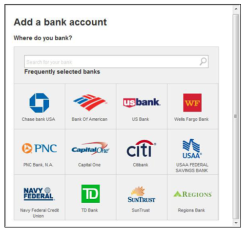
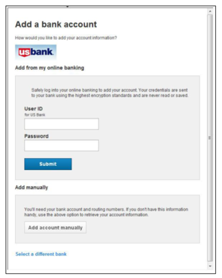
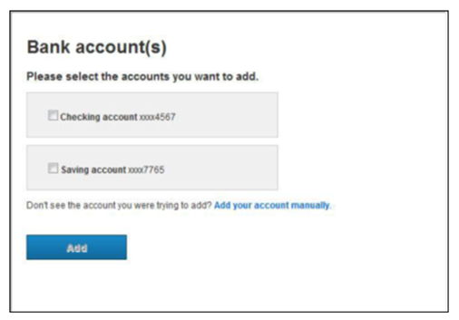

## Real-Time Verification and Addition (RTVA)

When a user tries to add an account for the FI via RTVA, they provide credentials for logging into the external FI. The user is put through Multi-Factor Authentication (MFA). Then account-related information is successfully scraped, and the name is passed through risk rules for matching logic to determine whether the accounts should be displayed to the user or not. If the information fails the check, the user is sent to add the account manually (see [Add Account Manually](?path=docs/add-account-manually.md)).

The name that comes in SSO will be compared against the name scraped by Aggregation. Risk rules for name matching determine if the account information should be displayed to the user.

### General Account Verification Flow
Regardless of which verification method is used, the first few steps will be the same.

<!-- theme: info -->

>**Note**   All forms of verification will not necessarily be available for all FIs. Users will have access to some or all verification methods, as applicable.

1.	Click the appropriate icon, or type in the search box.

2.	Here, the user will have the option of adding from their online banking website or adding an account manually.

<ul>
<li>To use Real-Time Verification and Addition, the user will enter the User ID and Password for their bank account and click the Submit button. The user will be redirected to Step 3.</li>
<li>To add an account manually, the user will click the Add Account Manually button. The user will be redirected to Step 4.</li>
</ul>

3.	Once the user successfully authenticates with the financial institution, they will need to choose which account(s) to add.

4.	Clicking the Add button will complete the verification flow.

a.	Selecting “Add your account manually” will take the user to the add account manually flow.

b.	Selecting “Select another financial institution” will take the user back to the VerifyNow landing page.

## See Also
[Add Account Manually](?path=docs/add-account-manually.md) 
[Verify Accounts Using VerifyNow](?path=docs/verify-accounts-using-verifynow/instant-verification.md)

