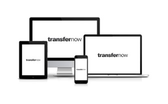
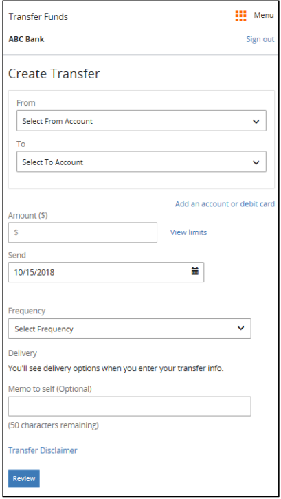
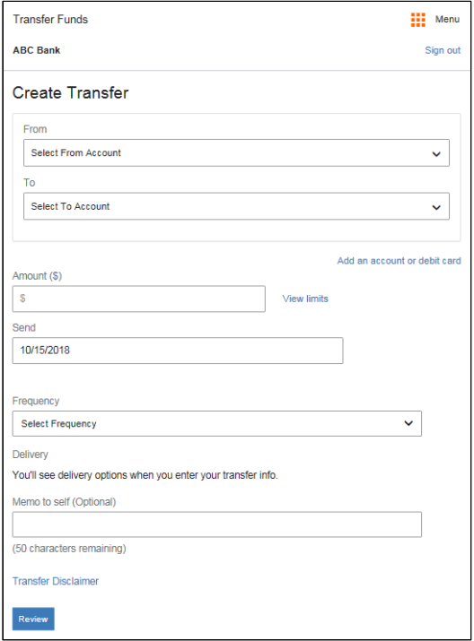

## Responsive Web Design

TransferNow implements Responsive Web Design, which optimizes the user experience by accommodating a range of differently sized screens, such as those used for standard mobile phones, for plus-sized mobile phones, and for laptops, desktops, and tablets.Responsive Web Design detects and adapts to the screen size of the user’s device, presenting a display format that best matches the device’s screen size. This is achieved in part through breakpoints (or breakpoint ranges)—sizes or size ranges, measured in pixels, that are specified as the points at which the display changes, depending on and adapting to the size of the device’s screen. 

 ``RESPONSIVE UI SCREENS``

<!-- align: center 

-->

Responsive Web Design detects and adapts to the screen size of the user’s device, presenting a display format that best matches the device’s screen size.This is achieved in part through breakpoints (or breakpoint ranges)—sizes or size ranges, measured in pixels, that are specified as the points at which the display changes, depending on and adapting to the size of the device’s screen.

> :memo: **Note:** The screenshot samples in this document are strictly representational; they are provided as examples only.

> :memo: **Note:** There are differences between the mobile-focused and desktop user interfaces. Most of the screenshot samples in this document are desktop-focused, unless otherwise specified.

  ``320*479 Pixel BreakPoint For Mobile Phones`` 

 ``480*767 Pixel BreakPoint For Mobile Phones`` 

  ``700 Plus Pixel Breakpoint For Larger Screens``

There is persistent navigation, located at the top or left-hand side of the screen for the breakpoint (768 plus pixels) optimized for larger screens (such as those used for desktops, laptops, and tablets) and this is a client-configurable option; and the content is generally left-aligned and wider. 
For the breakpoints at 480 and below, some functions are hidden, disabled or collapsed.