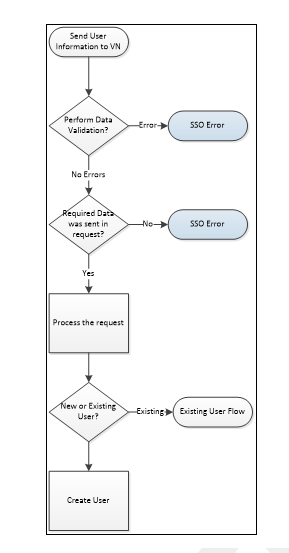

## VerifyNow User Workflow

## New User

The workflow for creating a new user is as follows:
1.	The client system collects information from the user and sends it to VerifyNow.
2.	VerifyNow receives user information from the client system and performs two checks:

    
<ul>
    <li>Data validation check:  If the data is valid, the process can continue to the next step. If the data is invalid, VerifyNow sends an SSO error back to the client system.</li>
    <li>User identity check: If the user is new, the process can continue to the next step. If the user is an existing user, VerifyNow checks the state to which the user must be returned.
    </li>
    </ul>
    

3.	If the user is new, VerifyNow creates a new user. If the user is an existing user, VerifyNow triggers the existing user workflow.         
&nbsp;

 

