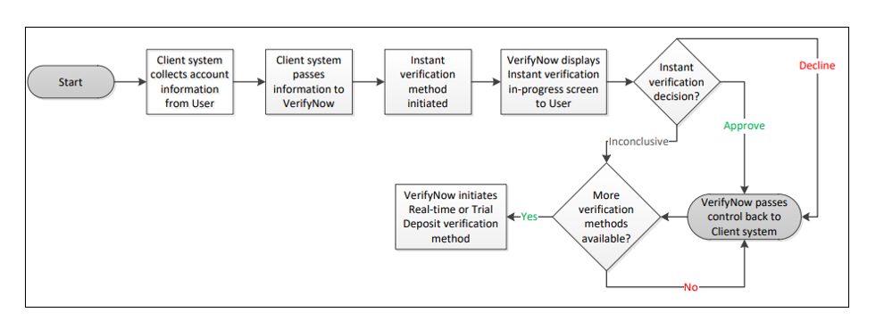
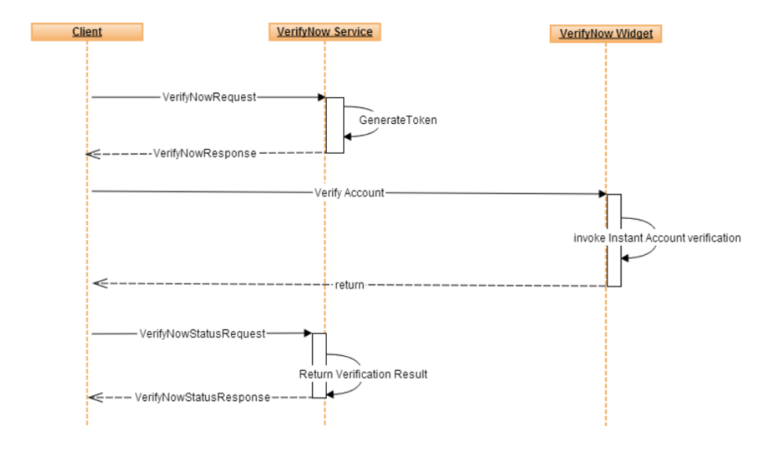
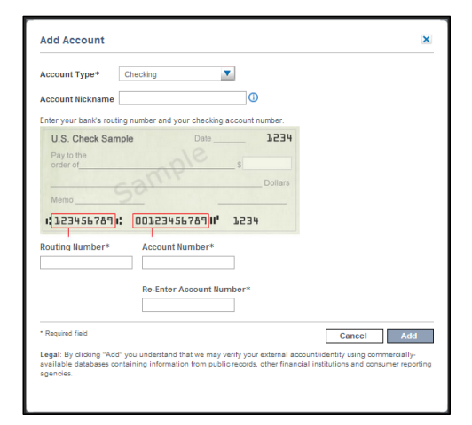

## Instant (Risk Database) Verification

This method provides instant bank account ownership verification using the Early Warning Services (EWS) account services and/or other available databases.

VerifyNow performs instant account verification using the Customer Information/Magnetic Ink Character Recognition (MICR) Match component of a check printer’s database. This service matches the user’s name and the account information with information in the database.

 > :memo: _**Note:**  The instant account verification service only verifies Demand Deposit Account (DDA) accounts. Savings, money market, and brokerage accounts are ineligible for account verification via this service._

 &nbsp;
 
> :memo: _**Note:**  The instant account verification service only verifies accounts with Routing Transit Number  (RTN)s listed in the MICR Table._

Instant verification is performed using the provided customer information and account details and the Early Warning Services (EWS) Account Ownership Authentication(AOA) database. EWS houses data contributed by various financial institutions with data elements including account holder names, address, tax ID, and additional elements leveraged that it uses to authenticate account ownership claims. EWS data is limited by the number of financial institutions that contribute to the product. EWS requires that clients contribute to the product to be allowed to use it.

<b>Instant Verification Process Flow</b>

<b>Instant Verification Sequence</b>

### Step-by-Step Instruction for Instant Verification
1. The client system collects account information from the user prior to initiating the widget. A sample screen is shown below:

2. The client system passes the information collected from the user to VerifyNow.

3. VerifyNow displays the Instant verification in-progress screen to the user as required.

4.  Instant verification is completed.

    a. If approved or denied, VerifyNow passes control back to the client system, along with the verification decision.

    b. If account ownership verification is inconclusive, Real-time verification or Trial Deposit verification can be initiated.

Click the Next button to see other verification methods. 

<a href="?path=docs/verifynow-account-verification-method.md">Back</a>

<a href="?path=docs/verifynow-account-verification-method/real-time-verification.md">Next</a>

