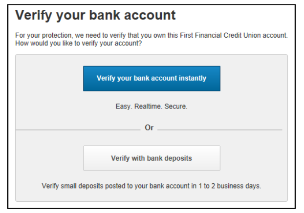
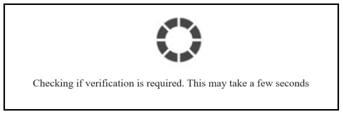

## Real-Time (using FI login) Verification

Real-Time (using FI login) Verification  method provides real-time bank account ownership verification for customers who have online banking accounts. The applicant’s username and password for the banking website are required for verification. VerifyNow performs real-time account verification by comparing data input by the user with data collected from the web site of the financial institution that services the account. The user is verified as the account owner if the two sets of data match.

If login is successful, VerifyNow compares the applicant’s name and account numbers from the external financial institution and what was provided by the client to verify account ownership in real time.

<b>Real Time Verification Process Flow</b>

<b>Real Time Verification Sequence Flow</b>

### Step-by-Step Instruction for Real-Time Verification

1.	The client system collects account information from the user prior to initiating the widget. The client system passes the information collected from the user to VerifyNow.
                         
2.	Instant Verification will be attempted first when enabled. The following Step occurs when Instant results are inconclusive, or Instant is not enabled. 

3.	VerifyNow offers the user the option to select the Real-time verification method or the Trial Deposit verification method.

4.	If the user selects the Real-time verification method (“Verify your bank account instantly”), VerifyNow initiates Real-time verification.  (If the user selects the Trial Deposit verification method (“Verify with bank deposits”), VerifyNow initiates Trial Deposit verification). Please see [Trial Deposit Verification](?path=docs/verifynow-account-verification-method/trial-deposit-verification.md) for more information.

5.	The user is asked to provide their username and password for the online banking portal where the user accesses their account.

6.	If multi-factor authentication (MFA) is required, the user is asked to provide additional information.

7.	If the user is verified, VerifyNow displays the Real-time verification in-progress screen to the user.

8.	Real-time verification is completed.
9.	VerifyNow passes control back to the client system, along with the verification decision.
10.	If the user is not approved, VerifyNow checks if the Trial Deposit verification method is available, and if available, gives the user the option to use Trial Deposit verification.

## See Also
[Trial Deposit Verification](?path=docs/verifynow-account-verification-method/trial-deposit-verification.md) 