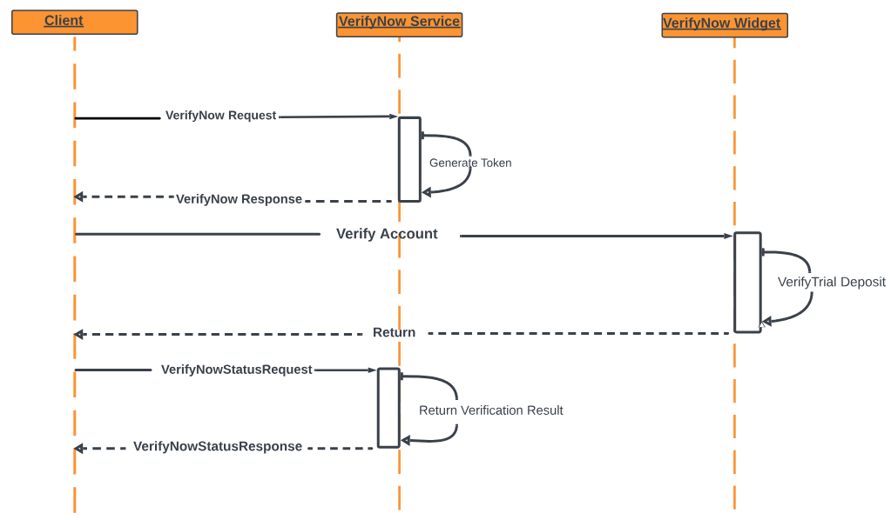

## Trial Deposit Verification

This method verifies customer’s access to an external bank account. Two small trial deposits and one trial debit are made to the external bank account and the customer is required to verify the two deposit amounts.  

> :memo: _**Note:** The amount of the debit is equal to the sum of the two deposits._

Shown below is an example of how Trial Deposit Verification works.

<b>Example:</b> 
1. On Monday, VerifyNow makes two trial deposits and a trial debit to the funding account via ACH. 
2. On Tuesday, VerifyNow receives confirmation that the trial deposits/debit were made and then sends an e-mail message to the applicant, notifying them to look for the deposit amounts in the funding account and to return to the system to confirm the deposit amounts. 
3. On Wednesday, the applicant returns to the system and enters the deposit amounts. If the amounts reported by the applicant match the VerifyNow deposits, the applicant’s account ownership is verified.

<b>Trial Deposit Verification Process Flow</b>

> :memo: _**Note:** Trial deposit verification involves a minimum of two interactions from the client to the Fiserv VerifyNow system._

<b>Trial Deposit Initiate Sequence</b>

<b>Trial Deposit Verification Sequence</b>

### Step-by-Step Instruction for Trial Deposit Verification

1.	The client system collects account information from the user prior to initiating the widget.                       
2.	The client system passes the information collected from the user to VerifyNow.
3.	If Instant Verification will be attempted first when enabled. The following step occurs when Instant results are inconclusive, or Instant is not enabled.
4.	VerifyNow offers the user the option to select the Trial Deposit verification method or the Real-time verification method.

5.	If the user selects the Trial Deposit verification method (“Verify with bank deposits”), VerifyNow initiates Trial Deposit verification. (If the user selects the Real-time verification option (“Verify your bank account instantly”), VerifyNow initiates Real-time verification). Please see [Real-Time (using FI login) Verification](?path=docs/verifynow-account-verification-method/real-time-verification.md) for more information.

6.	VerifyNow initiates Trial Deposit verification.
7.	VerifyNow presents the user with instructions on how to verify the account using Trial Deposit verification.

 &nbsp;

8.	After the trial deposits have been deposited into the user’s account, VerifyNow sends an e-mail notification to the user asking them to return to the site to confirm the deposit amounts.

9.	Trial Deposit verification is completed.
10.	VerifyNow passes control back to the client system, along with the verification outcome.
11.	If the user does not return in time to complete trial deposit verification, the user is shown the trial deposit expired message and control is passed back to the client system.

<li>Click the <button class="confirm-button">Back</button> button to see other verification methods.</li> 

<a href="?path=docs/verifynow-account-verification-method.md">Back</a>

