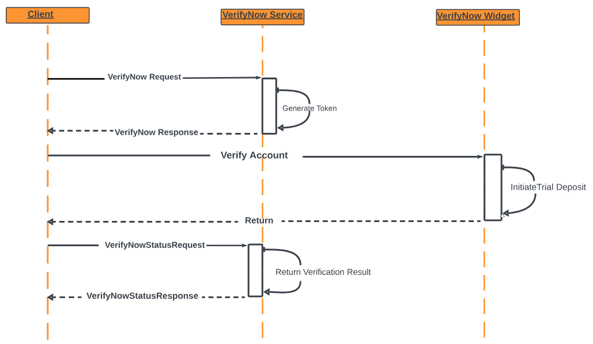

## Trial Deposit Verification

This method verifies customer’s access to an external bank account. Two small trial deposits and one trial debit (ACH Micro-Entries) are made to the external bank account and the customer is required to verify the two deposit amounts.  

> :memo: _**Note:**  The amount of the debit is equal to the sum of the two deposits._

Shown below is an example of how Trial Deposit Verification works.

1. On Monday, VerifyNow makes two trial deposits and a trial debit to the funding account via ACH. 

2. On Tuesday, VerifyNow receives confirmation that the trial deposits/debit were made and then sends an e-mail message to the applicant, notifying them to look for the deposit amounts in the funding account and to return to the system to confirm the deposit amounts. 

3. On Wednesday, the applicant returns to the system and enters the deposit amounts. If the amounts reported by the applicant match the VerifyNow deposits, the applicant’s account ownership is verified.

> :memo: _**Note:**  Trial deposit verification involves a minimum of two interactions from the client to the Fiserv VerifyNow system._

<b>Trial Deposit Initiate Sequence</b>

<b>Trial Deposit Verification Sequence</b>

## See Also
[Instant (Database) Verification](?path=docs/verifynow-account-verification-method/instant-verification.md) 
[Real-Time (using FI login) Verification](?path=docs/verifynow-account-verification-method/real-time-verification.md)

<a href="?path=docs/verifynow-account-verification-method.md">Back</a>

