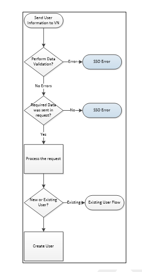

## VerifyNow User Workflow

## New User

The workflow for creating a new user is as follows:
1.	The client system collects information from the user and sends it to VerifyNow.
2.	VerifyNow receives user information from the client system and performs two checks:

         •	Data validation check:  If the data is valid, the process can continue to the next step. If the data is invalid, VerifyNow sends an SSO error back to the client system. 
         •	User identity check: If the user is new, the process can continue to the next step. If the user is an existing user, VerifyNow checks the state to which the user must be returned.
3.	If the user is new, VerifyNow creates a new user. If the user is an existing user, VerifyNow triggers the existing user workflow.         
&nbsp;

 

## Returning User

For returning users (i.e., users who begin the verification process, leave, and then return to complete the process), the following scenarios would apply:

Partners Using RTV, Instant, and Trial Deposit
When an account is present in SSO and in Compass:
  
  		If verification status is In Progress, the user is returned to the last page visited.
    	If verification status is Approved, the user is returned to re-verify the account.

When an account is present in SSO but absent in Compass:
  
    	If verification status is Not Applicable, the user is returned to the beginning of Account Verification.

When an account is absent in SSO and but present in Compass:

    	If verification status is Approved, the user is returned to the RTVA page to re-start the process.
    	If verification status is Not Applicable, the user is returned to the RTVA page to re-start the process.

When an account is absent in SSO and in Compass:

    	If verification status is Not Applicable, the user is returned to the RTVA page to re-start the process. 

 Partners Using RTV, Instant, and Trial Deposit

 When an account is present in SSO and in Compass:

    	If verification status is In Progress, the user is returned to the last page visited.
    	If verification status is Approved, the user is returned to re-verify the account. 

When an account is present in SSO but absent in Compass:   
  
    	If verification status is Not Applicable, the user is returned to the beginning of Account Verification.

When an account is absent in SSO and but present in Compass:

    	If verification status is In Progress, the user is returned to the Manual Account Addition page to re-start the process.    

When an account is absent in SSO and in Compass:

    	If verification status is Approved, the user is returned to the Manual Account Addition page to re-start the process.

    	If verification status is Not Applicable, the user is returned to the Manual Account Addition page to re-start the process.

    Partners Using RTV, Instant, and Trial Deposit    

When an account is present in SSO and in Compass:

    	If verification status is In Progress, the user is returned to the last page visited.
    	If verification status is Approved, the user is returned to re-verify the account. 

When an account is present in SSO but absent in Compass:

    	If verification status is Not Applicable, the user is returned to the beginning of Account Verification.

When an account is absent in SSO and but present in Compass:

    	If verification status is Approved, the user is returned to the Manual Account Addition page to re-start the process.

    	If verification status is In Progress, the user is returned to the Manual Account Addition page to re-start the process.

 When an account is absent in SSO and in Compass:

    	If verification status is Not Applicable, the user is returned to the Manual Account Addition page to re-start the process.   